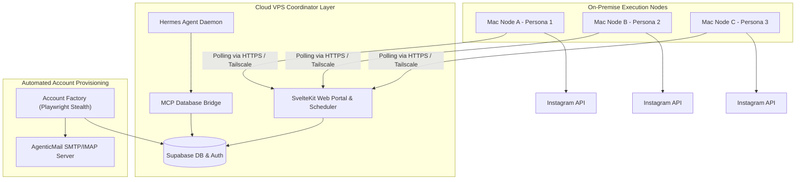

# PersonaGen Platform
### Enterprise AI Influencer & UGC Orchestration Suite

Welcome to the **PersonaGen Platform** repository. This suite provides a self-contained, turnkey solution for managing autonomous AI agents, scheduling multi-platform UGC content, and orchestrating stealth account networks. 

---

## 1. System Architecture

PersonaGen is built as a **hybrid cloud/on-premise** platform, designed to maximize system uptime and database integrity while maintaining a zero-cost, high-stealth posting profile using residential IPs.



*   **Cloud VPS Coordinator Layer**: Always-on central hub hosting SvelteKit, Supabase, and the Hermes Chief Overseer Agent. Exposes the portal to users and accepts inbound webhook payloads (e.g., Stripe, DocuSeal).
*   **Automated Account Provisioning**: Deployable services (`services/factory` and `services/mail`) that handle anti-detect browser automation and mail server hosting for verifying new persona accounts.
*   **On-Premise Execution Nodes**: Client-owned Macs situated on residential networks. They run lightweight daemons that poll the Cloud VPS, download generated content, and publish posts locally to bypass datacenter IP blocks.
*   **Tailscale secure network**: Connects the Cloud VPS and local Macs in a private, encrypted tunnel.

---

## 2. Directory Structure

The codebase is organized into modular components for ease of maintenance and deployment:

```
├── docs/
│   ├── onboarding/        # Onboarding manuals and living project specs
│   └── client-delivery/   # Client-facing setup, environment, and proxy manuals
├── personagen-svelte/     # SvelteKit 5 web portal (dashboard, scheduler, settings)
├── services/
│   ├── factory/           # Playwright-stealth automated account creator
│   ├── mail/              # Stalwart-based SMTP/IMAP verification capture server
│   └── mcp-bridge/        # Model Context Protocol (MCP) server for Supabase access
├── tools/
│   └── printing-press/    # Go-based CLI utilities for API interfacing
└── docker-compose.yml     # Multi-container orchestrator configuration
```

---

## 3. Quick Start & Deployment

### Local Development (Svelte Portal)
1. Navigate to the frontend directory:
   ```bash
   cd personagen-svelte
   ```
2. Install the Svelte and Tailwind dependencies:
   ```bash
   npm install
   ```
3. Start the Vite development server:
   ```bash
   npm run dev
   ```

### Production Deployment via Docker Compose (Easypanel)
The root `docker-compose.yml` configures SvelteKit, the Account Factory, the Stalwart SMTP/IMAP Mail Server, the Supabase Database Bridge, and the NousResearch Hermes Agent to run in a unified private network.

1. **Deploy to Easypanel**:
   - Create a new **Compose Project** in your Easypanel dashboard.
   - Link your GitHub repository.
   - Set the compose path to `docker-compose.yml`.
2. **Configure Environment Variables**:
   Ensure the required parameters are set in your project environment (see [Env Checklist](file:///c:/Users/nexal/personagendemo/docs/client-delivery/env-vars-checklist.md) for details):
   *   `PUBLIC_SUPABASE_URL`: Supabase project endpoint.
   *   `PUBLIC_SUPABASE_ANON_KEY`: Supabase public anonymous key.
   *   `SUPABASE_SERVICE_ROLE_KEY`: Service role credential.
   *   `MAIL_DOMAIN`: Domain for persona email boxes.
   *   `MCP_BRIDGE_TOKEN`: Secret token protecting the database bridge.
   *   `INTERNAL_API_SECRET`: Key shared between internal services.
3. Click **Deploy**.

---

## 4. Documentation Map

Refer to these documents for detailed instructions during system setup and handover:

### Client Delivery Guides
*   [Client Deployment Guide](file:///c:/Users/nexal/personagendemo/docs/client-delivery/README.md) — Step-by-step instructions for deploying to a production VPS.
*   [Environment Variables Checklist](file:///c:/Users/nexal/personagendemo/docs/client-delivery/env-vars-checklist.md) — Complete checklist of all configuration parameters.
*   [Proxy Strategy Guide](file:///c:/Users/nexal/personagendemo/docs/client-delivery/proxy-guide.md) — Setup details for budget, standard, and mobile proxies.

### Onboarding Documentation
*   [System Playbook](file:///c:/Users/nexal/personagendemo/docs/onboarding/02-system-playbook.md) — Full platform blueprint, cost projections, and architecture reference.
*   [Project Tracker](file:///c:/Users/nexal/personagendemo/docs/onboarding/03-project-tracker.md) — Operational log of milestones, decisions, and feature workstreams.
*   [Welcome Letter](file:///c:/Users/nexal/personagendemo/docs/onboarding/01-welcome.md) — Monarch Stack introduction and engagement guidelines.

---
*Monarch Stack — Fractional CTO Services*
